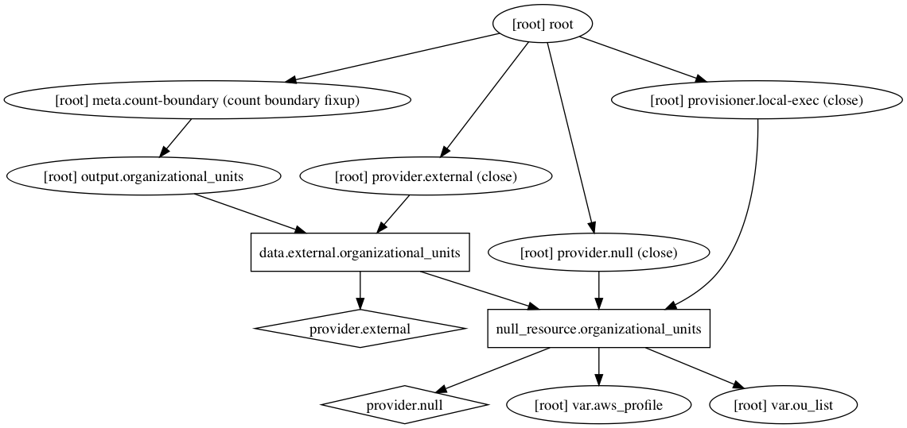

# terraform-aws-organizational-units

[](https://circleci.com/gh/devops-workflow/terraform-aws-organizational-units)
[](https://github.com/devops-workflow/terraform-aws-organizational-units/releases)

Terraform module to create organizational units in an AWS master account.

This is assumed to be a temporary implementation until OU support is added to Terraform

[Terraform registry](https://registry.terraform.io/modules/devops-workflow/organizational-units/aws)

## Usage

### Basic Example

```hcl
module "organizational-units" {
  source        = "devops-workflow/organizational-units/aws"
  version       = "0.0.1"
  aws_profile   = "master"
  ou_list       = "core environments"
}
```

<!-- BEGINNING OF PRE-COMMIT-TERRAFORM DOCS HOOK -->
## Inputs

| Name | Description | Type | Default | Required |
|------|-------------|:----:|:-----:|:-----:|
| aws\_profile | AWS profile in local credentials file that has rights to master account | string | - | yes |
| aws\_region | AWS region | string | `us-east-1` | no |
| ou\_list | List of organizational unit to manage. These will be top level under root | string | - | yes |

<!-- END OF PRE-COMMIT-TERRAFORM DOCS HOOK -->
<!-- BEGINNING OF PRE-COMMIT-TERRAFORM GRAPH HOOK -->

### Resource Graph of plan


<!-- END OF PRE-COMMIT-TERRAFORM GRAPH HOOK -->
